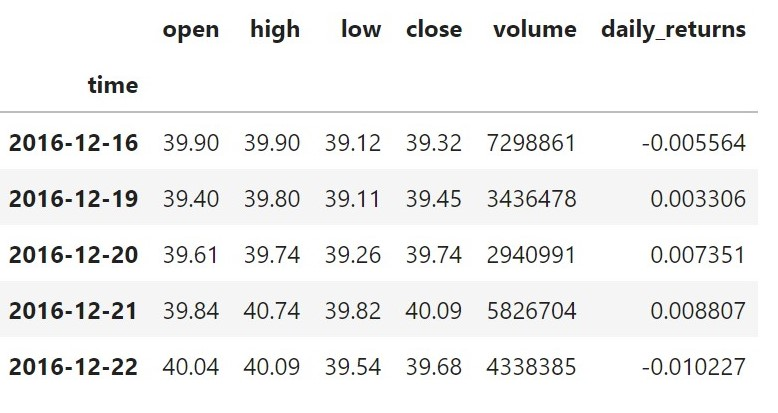

# ETF_Analyzer
This is a a simple project to analyze the performance of a custom ETF using a database, basic data visualization and the voila library to publish as a web app. It uses stock pricing data assembled in tables (one for each ticker) in a database. The example included is a hypothetical FinTech ETF with 4 stocks equally weighted; these are GDOT (Green Dot Corporation), GS (Goldman Sachs), PYPL (PayPal), and SQ (Block). To pull historical data for your own selection of stocks using the Alpaca Commission Free Trading API review the [Financial_Planning_Tools](https://github.com/daybydata/Financial_Planning_Tools.git) project in the [DaybyData](https://github.com/daybydata?tab=repositories) repository.

## How to Use

1. Make sure your development environment has access to the libraries listed in the Technologies section below.
2. Clone and Pull the github repository.
3. Open jupyter lab from the local directory of the repository.
4. Run all cells in the notebook etf_analyzer.ipynb.
5. From the terminal, run the following code:

`voila` <relative-path-to/>`etf_analyzer.ipynb`

This will generate a simple web app with the visualizations and output generated in the Jupyter notebook. (See example below.)

https://user-images.githubusercontent.com/94941017/162346875-a71060f7-fdb7-4c5b-8521-126e446755c0.mp4

## Technologies

This workbook was written in python 3.7. It uses the following libraries:

* [numpy](https://github.com/numpy/numpy) - For mathematical operations.

* [pandas](https://github.com/pandas-dev/pandas) - For dataframe tools and quantitative analysis.

* [sqlalchemy](https://github.com/sqlalchemy/sqlalchemy) - For database functionality.

* [voila](https://github.com/voila-dashboards) - For publishing Jupyter notebook output as a web application.

---

## Data

Data for this project are stored in the etf.db database. A separate table is provided for each ticker. Each table includes the following fields:

* open
* high
* low
* close
* volume
* daily_returns

---

## Contributors

Rachael Donham
rachaeldonham@gmail.com

---

## License

MIT

